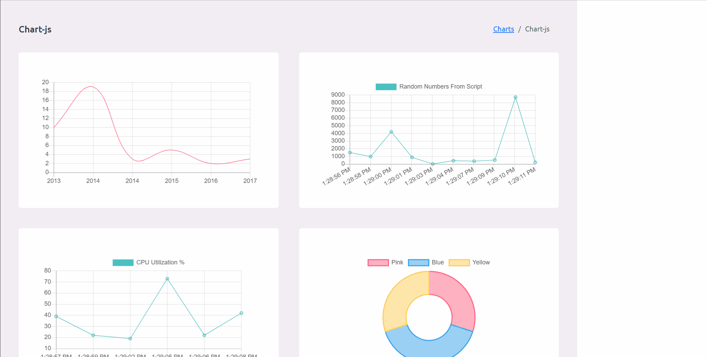

TraceAtlas Platform

TA Platform aims at handling close to realtime data coming from other TA components.
In this example we are sending data from TA Scriptainer to TA Platform and rendered in close to realtime.

The aim behind this project is to reduce the MTTR(mean time to respond) while helping App owners analyze applications 
and servers without having to login to servers. This project also will be focusing on close to realtime experience for test environments
to ensure developers have the best visibility during tests.

Go to: <a href="https://github.com/anwarfazaa/traceatlas_scriptainer" target="_blank">TraceAtlas Scriptainer</a>